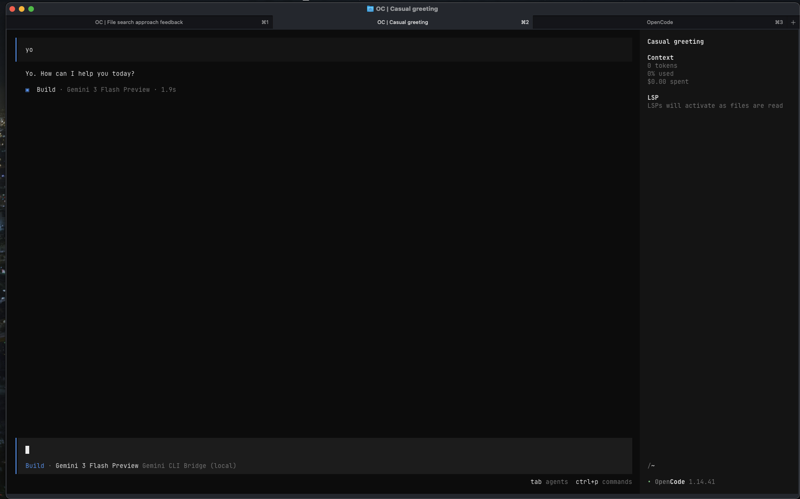

# Gemini CLI Bridge

[](https://opensource.org/licenses/Apache-2.0)
[](https://nodejs.org/)

<p align="center">
  
</p>

OpenAI-compatible API bridge for Google's Gemini CLI. Lets any OpenAI-compatible client (OpenCode, Open WebUI, Cursor, etc.) use Gemini models — including the full CodeAssist API with Google OAuth.

**Built on** [@Intelligent-Internet/gemini-cli-mcp-openai-bridge](https://github.com/Intelligent-Internet/gemini-cli-mcp-openai-bridge) and the [Gemini CLI](https://github.com/google-gemini/gemini-cli).

---

## What This Fork Fixes

The upstream bridge had a bug where tool schemas containing `$ref`/`$defs` (used by AI coding agents like OpenCode) were rejected by the Gemini CodeAssist API with:

```
Schema.ref 'QuestionPrompt' was set alongside unsupported fields.
```

**Root cause:** `sanitizeGeminiSchema()` stripped `$ref` but left `$defs`/`definitions` intact and never resolved `$ref` references inline. The Gemini API rejects schemas containing these JSON Schema keywords.

**Fixes applied:**
- Added `resolveRef()` to inline `$ref`/`ref` references from `$defs`/`definitions` before sanitization
- Added `ref`, `$defs`, `definitions` to the unsupported keys list
- Added `this.config.setModel()` so model selection in clients actually switches the Gemini model
- Added Geminie 3.x models (`gemini-3-flash-preview`, `gemini-3-pro-preview`, `gemini-3.1-pro-preview`, `gemini-3.1-flash-lite`)
- Handles both JSON Schema `$ref` and Google protobuf `ref` formats

---

## Quick Start

```bash
npm install -g @intelligentinternet/gemini-cli-mcp-openai-bridge

# Start with edit mode (allows file writing)
gemini-cli-bridge --mode edit --port 9000
```

Bridge starts at `http://127.0.0.1:9000/v1` — works with any OpenAI-compatible client.

---

## Models

The bridge exposes these models via `/v1/models`:

| Model ID | Gemini API Model |
|---|---|
| `gemini-3.1-pro-preview` | Gemini 3.1 Pro |
| `gemini-3.1-flash-lite` | Gemini 3.1 Flash Lite |
| `gemini-3-pro-preview` | Gemini 3 Pro |
| `gemini-3-flash-preview` | Gemini 3 Flash |
| `gemini-2.5-pro` | Gemini 2.5 Pro |
| `gemini-2.5-flash` | Gemini 2.5 Flash |

---

## OpenCode Integration

Add this provider to `~/.config/opencode/opencode.json`:

```json
{
  "provider": {
    "gemini-bridge": {
      "npm": "@ai-sdk/openai-compatible",
      "name": "Gemini CLI Bridge",
      "options": {
        "baseURL": "http://127.0.0.1:9000/v1"
      },
      "models": {
        "gemini-3.1-pro-preview": { "name": "Gemini 3.1 Pro" },
        "gemini-3.1-flash-lite": { "name": "Gemini 3.1 Flash Lite" },
        "gemini-3-pro-preview": { "name": "Gemini 3 Pro" },
        "gemini-3-flash-preview": { "name": "Gemini 3 Flash" },
        "gemini-2.5-pro": { "name": "Gemini 2.5 Pro" },
        "gemini-2.5-flash": { "name": "Gemini 2.5 Flash" }
      }
    }
  }
}
```

```bash
# Start bridge
GEMINI_MCP_PORT=9000 gemini-cli-bridge --mode edit

# OpenCode sees the models automatically
opencode models gemini-bridge
```

---

## Usage

```bash
# Start with defaults
gemini-cli-bridge

# Custom port
GEMINI_MCP_PORT=9000 gemini-cli-bridge

# Enable file writing
gemini-cli-bridge --mode edit --target-dir /path/to/project

# Debug logging
gemini-cli-bridge --debug
```

| Flag | Default | Description |
|---|---|---|
| `--port` / `GEMINI_MCP_PORT` | `8765` | Listen port |
| `--mode` | `read-only` | Security mode: `read-only`, `edit`, `configured`, `yolo` |
| `--target-dir` | cwd | Root for file operations |
| `--debug` | `false` | Verbose logging |

### Authentication

No extra auth config needed. The bridge uses the same cached OAuth credentials as the `gemini-cli` tool. If `gemini-cli` can talk to Gemini, so can the bridge.

---

## Endpoints

| Endpoint | Method | Description |
|---|---|---|
| `/v1/chat/completions` | POST | OpenAI-compatible chat (stream + non-stream) |
| `/v1/models` | GET | List available models |
| `/mcp` | SSE | MCP protocol endpoint |

---

## Credits

- **Original project:** [@Intelligent-Internet/gemini-cli-mcp-openai-bridge](https://github.com/Intelligent-Internet/gemini-cli-mcp-openai-bridge)
- **Gemini CLI:** [google-gemini/gemini-cli](https://github.com/google-gemini/gemini-cli)
- **$ref fix + model switching:** [bulgadev](https://github.com/bulgadev) + [OpenCode](https://opencode.ai)

---

## License

Apache License 2.0 — see [LICENSE](LICENSE).
